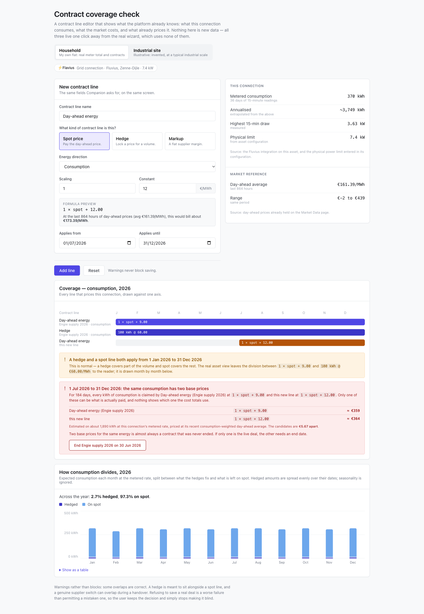

# Contract coverage check

A prototype for the Companion.energy contract management case.

It is a contract line editor for a grid connection. As you fill in a line, it
checks the line against what is already known about that connection: how much
it consumes, how much power it can physically draw, what day-ahead electricity
has cost recently, and which contract lines already price it. When two lines
compete for the same energy, it shows what each would cost and offers to end
the older one.



---

## Running it

Requires Node.js 18 or newer.

```bash
npm install
npm run dev      # then open http://localhost:5173
```

Other commands:

```bash
npm test         # run the test suite (98 tests)
npm run build    # type-check and build for production
```

There is no backend, login or database. All data is mocked and built into the
app.

---

## What's on the screen

**Connection switch** (top). Two connections to try the checks on:

- **Household:** a flat with real meter totals and contracts
- **Industrial site:** an invented plant at typical industrial scale, where the
  same mistakes are worth thousands of euros

Both open with a new **Day-ahead energy** line from 1 July to 31 December 2026,
on a connection whose existing contract already prices the whole year.
Switching starts the other connection from its own contracts.

**New contract line** (left). The form for the line being added:

- Line types: **Spot price**, **Hedge** and **Markup**
- Energy direction: consumption or injection
- Spot: scaling and constant, with a formula preview that also shows what the
  line would have cost per MWh at recent day-ahead prices
- Hedge: volume in **kWh** or **kW**, and a price in €/MWh
- Markup: a flat €/MWh amount
- The dates the line applies

**Context panel** (right). Updates as you type:

- *This connection:* metered consumption, the yearly figure it extrapolates to,
  the highest 15-minute draw, and the physical power limit
- *What this hedge covers* (hedge lines only): the share of the connection's
  expected consumption during the line's dates, the same volume expressed in
  days of typical use, and a warning when the volume looks wrong
- *Market reference:* the recent day-ahead average and range, and how a hedge
  price compares with that average

**Coverage** (below). Every line pricing the connection across 2026 on one
timeline, followed by a notice for each overlap or gap. A notice for two
competing spot lines estimates what each would cost and has a button that ends
the older contract the day before the new line starts.

**How consumption divides** (bottom). One column per month: the volume the
hedges fix and the volume left on spot, with hedged volume beyond consumption
on top. Hover or focus a month for its figures, or open the table view.

**Add line** stores nothing. It only confirms that warnings do not block
saving. **Reset** restores the connection's original contracts and line.

---

## What it checks

Nothing is ever blocked. Every check below produces a warning or a note.

| Situation | What the app shows |
| --- | --- |
| Two spot lines for the same direction on overlapping dates | A red warning naming both lines, their prices, the number of days that overlap, and an estimate of what each would cost over those days |
| ...and one of them started first | A button to end that one's contract the day before the other starts |
| A hedge and a spot line on the same dates | An amber note: this is normal, and the chart shows how the volume divides |
| One line ending 30 June and the next starting 1 July | Nothing. A clean handover is not an overlap |
| A markup on the same dates as anything else | Nothing. Markups add to a price rather than compete with it |
| Three or more lines overlapping on the same dates | One combined warning, not one per pair |
| Days in 2026 with no spot or hedge line for consumption | A gap warning |
| A hedge under 5% of expected consumption for its dates | "This hedge is very small for this connection" |
| A hedge over 100% of expected consumption for its dates | "This hedge exceeds what the connection consumes", and red columns in the chart |
| A hedge in kW above the connection's physical limit | "More power than this connection can draw" |
| A hedge price more than 5× above or below the market average | Flagged as a likely typo or unit mix-up |
| A hedge price within that range | Shown as a percentage above or below the market, without a warning |

How the figures are worked out:

- A hedge in **kW** is that much power in every hour of the line's dates. A
  hedge in **kWh** is a total amount, spread evenly over those dates.
- Expected consumption is the metered daily rate times the number of days. It
  ignores seasonality.
- Cost estimates apply each line's formula to the day-ahead price weighted by
  when the connection actually consumed, over the metered period.
- Ending a contract early keeps only the share of a kWh hedge that falls
  before the new end date.

---

## Things to try

On **Household**:

1. **Change Applies from to 1 January.** The overlap warning grows to the full
   year.
2. **Set it back to 1 July and click "End Engie supply 2026 on 30 Jun 2026".**
   The old contract stops the day before, the warning clears, and **Reset**
   brings it back.
3. **Switch the line type to Hedge and set Applies from to 1 January.** The
   100 kWh volume is 2.7% of the year's expected consumption and is flagged as
   very small.
4. **Set Applies from back to 1 July and the volume to 2,000 kWh.** That is
   about half a year's consumption, but more than the connection uses between
   July and December. It is flagged, and the chart turns those months red.
5. **Switch the unit to kW and set the volume to 10.** That is 44,160 kWh over
   the six months, and more power than the 7.4 kW connection can draw.
6. **Set the hedge price to 5.** It is flagged as more than five times below
   the market. Set it to 60 and it is reported as 63% below the market,
   without a warning.

On **Industrial site**:

7. **Look at the overlap warning.** The two candidate contracts are about
   €2,160 apart over six months.
8. **Switch the line type to Hedge.** The 400 kWh volume is less than 0.1% of
   the site's consumption: what typing 400 in kWh looks like when the supplier
   contract says 400 MWh.

Gap warnings are covered by the tests but cannot be triggered from the screen,
because the existing contracts already cover all of 2026.

---

## Mock data

Everything lives in [`src/data/`](src/data/) and is generated
deterministically, so the app looks the same on every load. Both connections
share the same day-ahead prices.

| Data | Household | Industrial site |
| --- | --- | --- |
| Source | Real meter total and contracts | Invented, for illustration |
| Connection | "Flavius", Fluvius Zenne-Dijle, 7.4 kW | "Ghent plant", Fluvius medium voltage, 500 kW |
| Meter readings | 15-minute readings, 1 September to 6 October 2026, 369.73 kWh in total, household-style daily profile | Same period, about 1.7 GWh a year, two weekday shifts and a low base load |
| Existing contract | *Engie supply 2026*: `1 × spot + 9.00` and a hedge of 100 kWh at €60/MWh | *Annual supply 2026*: `1 × spot + 4.00` and a hedge of 800,000 kWh at €95/MWh |
| New line | `1 × spot + 12.00` from 1 July | `1 × spot + 6.50` from 1 July |

Day-ahead prices are hourly for the same period, averaging about €161/MWh,
with a midday dip, an evening peak, occasional spikes and occasional negative
hours.

---

## Project structure

```
src/
  domain/                 logic only, no React
    types.ts              the data model: lines, contracts, assets, readings
    coverage.ts           overlap and gap detection
    volume.ts             consumption summary, hedge coverage, kW/kWh conversion
    market.ts             market summary and hedge price comparison
    cost.ts               what competing lines would cost over an overlap
    contracts.ts          ending a contract and suggesting which one to end
    split.ts              month-by-month division between hedge and spot
    *.test.ts             tests for the above
  data/
    scenarios.ts          the two connections the app switches between
    mockData.ts           the household connection and the day-ahead prices
    factory.ts            the industrial site
    random.ts             the deterministic random source the data uses
  components/
    LineForm.tsx          the new line form
    ContextPanel.tsx      consumption, hedge coverage and market reference
    CoverageTimeline.tsx  all lines on one 2026 axis
    ConflictNotice.tsx    overlap and gap notices, with cost and fix
    ConsumptionSplit.tsx  the month-by-month chart
    format.ts             number formatting shared by the components
  styles/
    tokens.css            colours, spacing and type scale
    app.css               component styles
    split-chart.css       chart styles
  App.tsx                 the page and the connection switch
  Workspace.tsx           one connection's state, wiring the logic to the components
```

All decisions are made in `domain/`, which is tested without rendering
anything. The components only display the results.

Built with React 18, TypeScript, Vite and Vitest. Styling is plain CSS.

---

## Scope

The app covers three line types (spot, hedge and markup) for consumption in
2026. It does not include editing existing lines one by one, time-of-day
windows, the other line types, saving, or layouts below tablet width.
